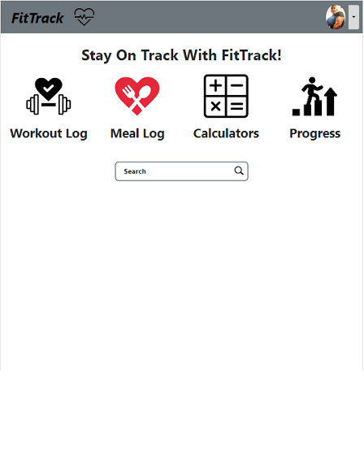
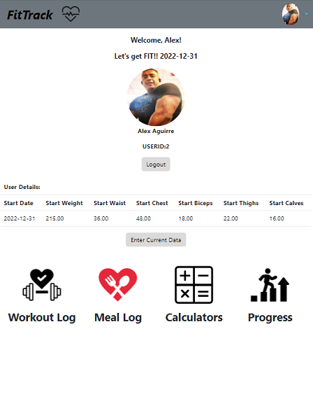
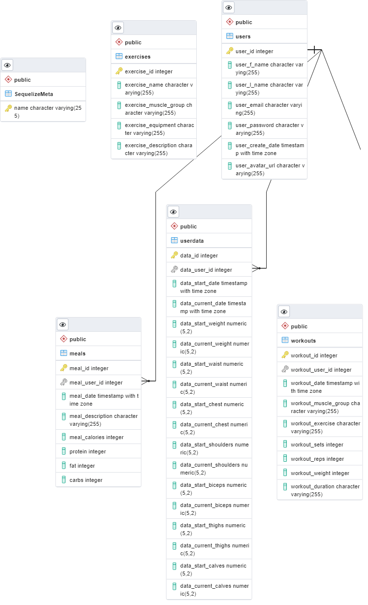

# Fitness Tracker 
## Visit our current version here 
https://fittrack-frontend.herokuapp.com/  
### API
https://fittrack-apiv3.herokuapp.com/
## Inspiration
Compare yourself to who you were yesterday, not to who someone else is today -Jordan Peterson. 
Our team consists of not only dedicated programmers but also fitness enthusiasts who strongly value being compassionate to clients' needs/wants in the fitness and developer industry while being a coach or leader for others in their fitness or program team. We constructed a fitness-tracking application for those attempting to monitor meal, workout weight, and progress following along with weight and size proportions. As fitness enjoyers, it's important that we keep a close eye on our progress to determine what we need to change or improve on to maximize progress.  
Coming together is a beginning; keeping together is progress; working together is success. -Edward Everett Hale  

## Details
User will be able to register and login into the Fitness Tracker. 
 
Once logged in they will be able to update the own personal data to track their progress on their weight and measurements.  
They will also able to log their workouts and meals to track their calorie consumption. 
They will be able to select different exercises to target specific muscle groups. 
The interface will be resizable to view on different size screens.  
 

## Technology
* 	
*   
*   
*   
*   
*    
*   
*   
*   
*   
* RapidAPI to access exercises
* BCrypt - Security to Hash Password
 
 

## Screenshots

### Home

 

### Profile
 

 

## API - Controllers
* Local:  http://localhost:5500
* Deployment: https://fittrack-apiv3.herokuapp.com/
 

### Register and Login Authentication
| Method | Path | Purpose |
|--------|------|---------| 
|POST | authentication/ | Authenticate User|
|GET | authentication/profile | Retrieve User data|
 

### Users & UserData
| Method | Path | Purpose |
|--------|------|---------|
|POST | /* | Login and Assign JWT|
|GET | /profile | Get User Data for Profile |
 

### Workouts
| Method | Path | Purpose |
|--------|------|---------|
|GET | / | Get all workout logs for User for selected date|
|POST| / | Create a workout log for User|
|PUT | /:id | Update a workout log for User |
|DELETE| /:id | Delete a workout log for User|
 

### Meals
| Method | Path | Purpose |
|--------|------|---------|
|GET | / | Get all meal logs for User for selected date|
|POST| / | Create a meal log for User|
|PUT | /:id | Update a meal log for User |
|DELETE| /:id | Delete a meal log for User|
 

## Database Structure
 

Users 1:1 with UserData on user_id  
Users 1:n with Workouts on user_id  
Users 1:n with Meals on user_id 
Exercises (3rd Party API)  
 

## Issues Encountered

### In Application
Date Selector Input causes crash when attempting to input values with keyboard. 
  
Possible Solution: change method to select date? maybe utilizing a package?

### Deployment
Initially, we attempted to deploy our App using AWS Amplify but due to the app file structure, the build failed.  
Initially, we attempted to deploy our App using AWS Beanstalk but due to the app file structure, the build failed.  
It also required that we install ELB CLI, Python, virtualEnvironment and was requesting to change Windows/System32 files and paths. It's over complicated, so we took another route
<pre><b>Resolution:</b>
Having successfully deployed on Heroku, we chose this for deployment.
We recreated a basic app, deployed on Heroku successfuly the continued to resolve the app file structure</pre>

### File Structure
On our Version 1, we realize that we nested the backend and frontend without server.js and Package.json at the root.  
<pre><b>Resolution:</b> 
We recreated the App with the proper monorepo file structure and copied the code into their respective files.
We needed to update all the relative paths to reflect the new file strutures.
Ran the app and it works great, but ran into the issue of the server running on port 5000, but the frontend not running on Port 3000
</pre>

### Running the APP - not running port 3000
When running npm start from the root folder, it tries to run on PORT 5500, but that is for the server.  
The npm start says there is already an app running on port 5500, and sets the default port to run on port 5501
The app launches fine, but then runs into a CORS issue
<pre><b>Resolution:</b>
We discovered that on the monorepo we needed to launch two separate termials.
We start the server first with Nodemon server.js
and then launch the frontend with NPM Start and click Y to assign a new port
</pre>

### CORS Access Errors
When running the app, we check to see if the CurrentUser is logged in which is done with a fetch request.  
This returns an error on the console on the local client because the origin header shows port: 5001 and does not match the server port:5501.  
On the deployment version, it is trying to hit the path LocalHost:5500, and that doesn't exist on the web server.
<pre><b>Resolution:</b>
On the local machine, we needed to add the methods allowed when using credentials set to true.
Added the origin port to point to 5501
Added the allowed methods to the CORS Options and it cleared all the CORS errors on preflight.
</pre>

### Setting FETCH Path
We set the fetch request to a static path  https://localhost:5000, and the creates an issue with the deployment server.
<pre><b>Resolution:</b>
In order for the app to work on deployment, we needed to create an API and update all the fetch paths to this API
We deployed a separate frontend to access to consume the API
</pre>

## Future Updates
* Connect with 3rd Party API and display search results for specified exercises.
* Implement calculators and routes for each of them. (e.g. Resting-heart-rate, One-rep-max, Macros, Target-heart-rate, BMI, BMR, etc.)
* Connect with 3rd Party API to display Motivational quotes in different routes within app.
* Implement challenges route to give users potential goals to achieve.
* Display graph of progress within profile page.

## Contributors

[Alex Aguirre](https://github.com/AlexAguirre70)  
[Gustavo Martinez ](https://github.com/Gustavo0623)  
[Matthew Herrera](https://github.com/Machew115)  
